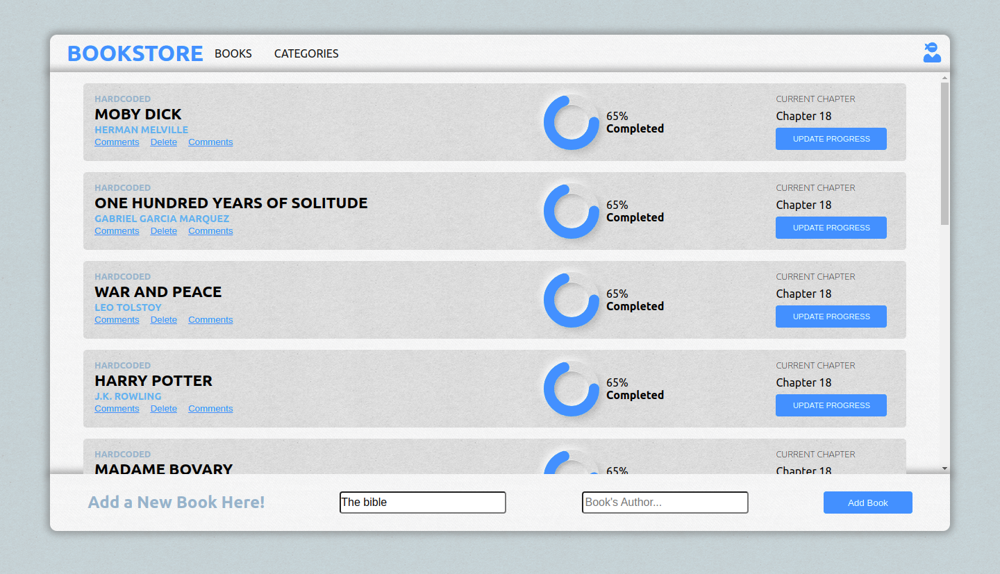

# Bookstore React APP

> The Bookstore is a website built with React and Redux. This web app will allows you to:

- Display a list of books.
- Add a book.
- Remove a selected book.
- View and update your progress reading the book

This project was bootstrapped with [Create React App](https://github.com/facebook/create-react-app).

## Quick view
> 

## Live Demo

[Press here to see the Bookstore live](https://bookstorewilliamscch.netlify.app/)

## Available Scripts

In the project directory, you can run:

### `npm start`

Runs the app in the development mode.\
Open [http://localhost:3000](http://localhost:3000) to view it in your browser.

The page will reload when you make changes.\
You may also see any lint errors in the console.

### `npm test`

Launches the test runner in the interactive watch mode.\
See the section about [running tests](https://facebook.github.io/create-react-app/docs/running-tests) for more information.

### `npm run build`

Builds the app for production to the `build` folder.\
It correctly bundles React in production mode and optimizes the build for the best performance.

The build is minified and the filenames include the hashes.\
Your app is ready to be deployed!

See the section about [deployment](https://facebook.github.io/create-react-app/docs/deployment) for more information.

### `npm run eject`

**Note: this is a one-way operation. Once you `eject`, you can't go back!**

If you aren't satisfied with the build tool and configuration choices, you can `eject` at any time. This command will remove the single build dependency from your project.

Instead, it will copy all the configuration files and the transitive dependencies (webpack, Babel, ESLint, etc) right into your project so you have full control over them. All of the commands except `eject` will still work, but they will point to the copied scripts so you can tweak them. At this point you're on your own.

You don't have to ever use `eject`. The curated feature set is suitable for small and middle deployments, and you shouldn't feel obligated to use this feature. However we understand that this tool wouldn't be useful if you couldn't customize it when you are ready for it.

## 👤 Author

- GitHub: [@williamscch](https://github.com/williamscch)
- Twitter: [@wdavidcch](https://twitter.com/wdavidcch)
- LinkedIn: [LinkedIn](https://www.linkedin.com/in/williams-colmenares-989a6b151)

## 🤝 Contributing

Contributions, issues, and feature requests are welcome!

Feel free to check the [issues page](../../issues/).

## Show your support

Give a ⭐️ if you like this project!

## Acknowledgments

- Microverse Module 3 React and Redux.
- Project indications [here](https://github.com/microverseinc/curriculum-react-redux/blob/main/bookstore/sneak_peek_v2_0.md).
- Design based on a Microverse's Zepling project.

## 📝 License

This project is [MIT](./MIT.md) licensed.
